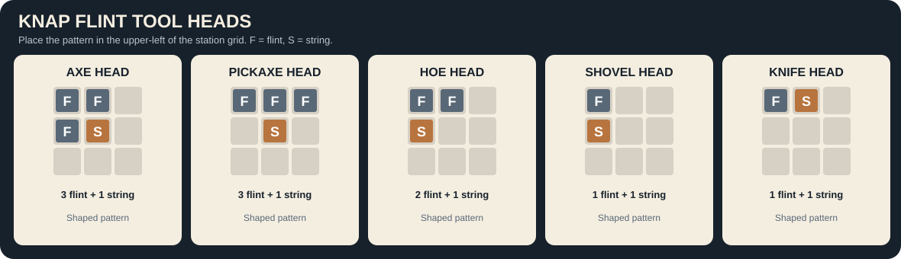
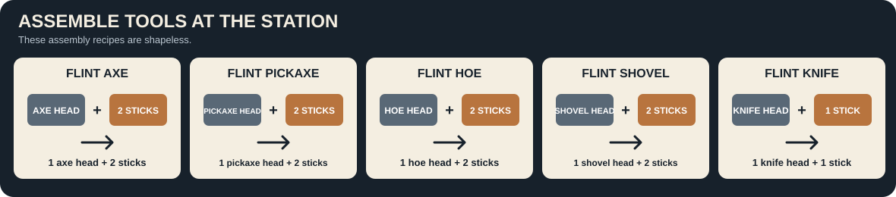
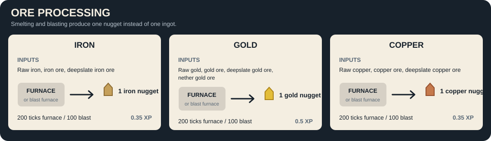

# Primitive Isolation Recipe Wiki

This page lists the custom crafting recipes and vanilla ore-processing recipes changed by Primitive Isolation.

## Knapping and assembly station

Use the **Knapping and Assembly Station** to shape heads and assemble tools. Head patterns must be placed in the upper-left corner of the station's 3x3 grid. In the patterns below, `F` means flint, `S` means string, and `.` means an empty slot.

| Result | 3x3 pattern |
| --- | --- |
| Flint axe head | `FF. / FS. / ...` |
| Flint pickaxe head | `FFF / .S. / ...` |
| Flint hoe head | `FF. / S.. / ...` |
| Flint shovel head | `F.. / S.. / ...` |
| Flint knife head | `FS. / ... / ...` |

Assemble tools shapelessly in the station:

| Result | Ingredients |
| --- | --- |
| Flint axe | 1 flint axe head, 2 sticks |
| Flint pickaxe | 1 flint pickaxe head, 2 sticks |
| Flint hoe | 1 flint hoe head, 2 sticks |
| Flint shovel | 1 flint shovel head, 2 sticks |
| Flint knife | 1 flint knife head, 1 stick |

Flint tools use the same harvest tier as wooden tools and have 29 durability (wood tools have 59). Flint axes, pickaxes, hoes, and shovels retain their existing speed and attack stats.
Log blocks only drop wood when harvested with an axe, including the flint axe.

## Animal butchering

Craft a **Butchery Table** with 3 planks and 4 sticks (`PPP / S.S / S.S`, where `P` is any plank and `S` is a stick).

Cows, pigs, and chickens leave a ground carcass when killed. Right-click a carcass with an empty hand to pick it up as an item. To field-butcher it instead, hold a flint knife and keep using it for 30 seconds; this yields only 1 meat. Left-clicking does not harvest the carcass. Each uncollected carcass decomposes after 5 minutes, and zombies can eat carcasses over 10 seconds.

For the larger yield, right-click the Butchery Table while holding the carcass to place it on the table. The table displays which animal is loaded. Hold right-click on the loaded table with a flint knife for 10 seconds to process it, or use an empty hand to pick it back up.

| Carcass | Butchery Table yield |
| --- | --- |
| Cow | 3 beef, 1 leather, 1 bone |
| Pig | 3 porkchops, 1 leather, 1 bone |
| Chicken | 2 chicken, 1 feather, 1 bone |

Items that do not fit in the player's inventory when processed are discarded.

## Charcoal pit

Craft a **Charcoal Pit Core** from 4 dirt and 1 flint (`D.D / .F. / D.D`). Place the core in the center of an odd-sized 3x3, 5x5, 7x7, or 9x9 footprint; the core itself takes up the center spot, and every other spot must contain a log. For example, a 9x9 footprint needs 80 logs. Cover each log with dirt, grass, or clay, then build a one-block-thick dirt/grass/clay wall around the footprint, including its corners. The 9x9 footprint needs an 11x11 outer wall. Leave only the north and south center blocks of that wall open as vents; keep the block above the core open as the chimney.

Use flint and steel on the core to start the pit. Right-click an active core to check its remaining time. It consumes the logs and yields 1 charcoal per log after 150 ticks per log. Logs can no longer be smelted into charcoal; the charcoal pit is the intended source. A core lasts for a randomly determined **1–10 completed runs**, then burns out and is destroyed.

| Pit size | Logs | Charcoal | Time |
| --- | ---: | ---: | ---: |
| 3x3 | 8 | 8 | 60 seconds |
| 5x5 | 24 | 24 | 3 minutes |
| 7x7 | 48 | 48 | 6 minutes |
| 9x9 | 80 | 80 | 10 minutes |

## Chunk Anchor

Craft a **Chunk Anchor** with an Eye of Ender in the center and iron ingots in all eight surrounding crafting slots. By default, right-click it with an Ender Pearl to fuel one hour of loading for its chunk; additional pearls add another hour. The `chunkAnchorRequiresFuel` common config option defaults to `true`; set it to `false` to keep chunks with Chunk Anchors loaded without fuel. Each anchor affects only its own chunk, and removing the last active anchor stops forcing that chunk to stay loaded.

## Food spoilage and preservation

Butchered meat is modded food. Raw meat and fish spoil after **20 minutes** and turn into rotten flesh. Vanilla loot-table drops of raw meat and fish are replaced with modded perishable versions, and existing dropped items/player inventory stacks are converted too, so vanilla cooking recipes cannot bypass spoilage. Their tooltips show the remaining time before spoilage.

Craft a **Salting Rack** with 6 planks and 2 sticks (`PPP / S S / PPP`). Load up to 3 raw meat or fish pieces across the top row, put salt below them, and collect the salted food from the bottom row. It processes one piece at a time, taking **1 minute per piece** and consuming **2 salt per piece**. Fresh meat and fish spoil after **20 minutes**; salting extends that time by 1.5x, to **30 minutes**. The timer continues while food is in the rack; spoiled input is removed and rotten flesh drops beside the rack.

Smokers turn salted food into smoked food with **5x the salted timer**, or **150 minutes**. Smoked meat and fish can be stored in a **Preserving Bin**, crafted with 8 planks around a chest (`PPP / PCP / PPP`). The bin has 27 chest-style storage slots and a dedicated slot for Minecraft ice. One ice block preserves all stored perishable food for **2 hours 20 minutes**; food's remaining spoil timer is paused while the bin is chilled and resumes when its ice runs out or is removed. The bin preserves raw, salted, and smoked food according to each item's own spoil duration. Food that spoils in the bin turns into rotten flesh in its storage slot.

Salt comes from natural underwater salt deposits that generate in clay-like patches on water floors. Each deposit drops 4 salt.

| Process | Input | Output |
| --- | --- | --- |
| Salting Rack | 1 raw meat or fish + 2 salt | 1 salted item of the same type (1 minute) |
| Smoker | 1 salted meat | 1 smoked meat of the same type (5 seconds) |
| Smoker | 1 salted fish | 1 smoked fish of the same type (5 seconds) |

Raw cod and salmon can still be cooked in a furnace or smoker to their usual cooked fish.

Use any spear to harvest cod, salmon, tropical fish, or pufferfish with a melee hit while the fish is in water. The hit kills the fish and its normal raw-fish drop is subject to the same spoilage timer.

## Ice shards

Regular ice mined without Silk Touch drops a random **2–4 Ice Shards**. Silk Touch continues to drop the ice block. Craft regular ice with 8 Ice Shards surrounding a snow block (`SSS / SNS / SSS`).

## Ore processing

Each input listed below can be processed in either a furnace or a blast furnace. Each recipe produces **1 nugget** instead of an ingot.

| Metal | Smeltable and blastable inputs | Experience per smelt |
| --- | --- | ---: |
| Iron | Raw iron, iron ore, deepslate iron ore | 0.35 XP |
| Gold | Raw gold, gold ore, deepslate gold ore, nether gold ore | 0.5 XP |
| Copper | Raw copper, copper ore, deepslate copper ore | 0.35 XP |

Furnace recipes take 200 game ticks; blast furnace recipes take 100 game ticks. Experience is awarded when the finished nugget is collected.

## Miscellaneous features

Lit campfires can start normal fire beside an adjacent flammable wood block. Each adjacent wooden block has an independent chance to ignite, averaging about once per minute while the campfire is lit. Keep campfires away from wooden structures.
